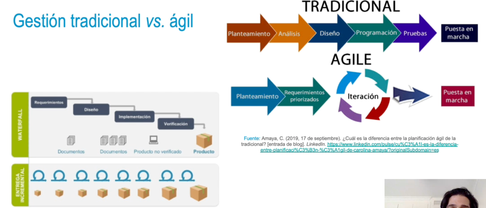
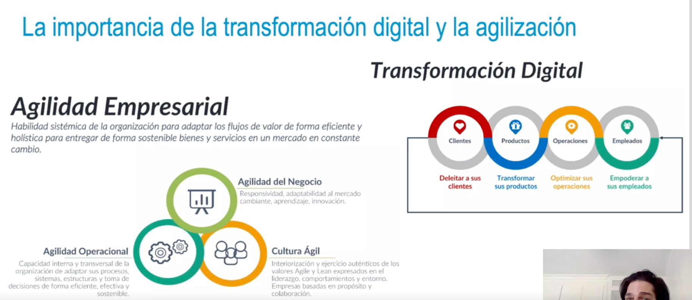

### Contexto de la gestión de proyectos
• Conjunto de acciones y metodologías aplicadas para alcanzar un objetivo definido mediante la
planificación y dirección de los procesos de un proyecto.
• Crisis del software por las dificultades surgidas Darante la gestión de proyectos (costes excesivos,
incumplimiento plazos entregas, insatisfacción usuarios, software baja calidad)
• Metodologías tradicionales con enfoque predictivo y secuencial.
• Metodologías ágiles con enfoque incremental e iterativo.
- 
- ### ¿Cuál es la realidad en los proyectos?
  • Los clientes no saben lo que quieren hasta ver el funcionamiento.
  • Los equipos de desarrollo descubren cuál es la mejor ejecución durante el desarrollo.
  • Se pueden producir diversos cambios a los que habrá que adaptarse.
  • Cualquier proyecto de transformación digital debe poder ser ágil.
  • Proyectos de investigación, desarrollo software, ciencia de datos, consultoría.
  • Objetivos: ahorrar costes, calidad, disminuir pérdidas, valor añadido.
- ### Ejemplo práctico: diseño de un sitio web
  • ¿Se debe esperar a tener todas las funciones desarrolladas para generar valor de negocio?
  • Objetivo: conseguir resultados lo antes posible.
  • Si se estiman seis meses para el desarrollo completo, lograr en un mes y medio una versión con
  el catálogo de productos.
  • Se puede empezar a explotar ese resultado parcial. No es solo documentación de análisis y
  diseño, es algo en funcionamiento.
  • Obtener pronto feedback.
- 