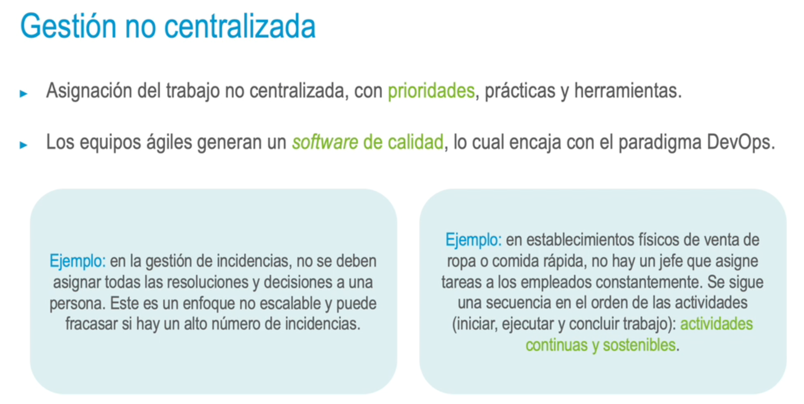
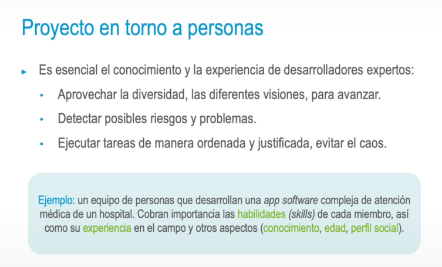
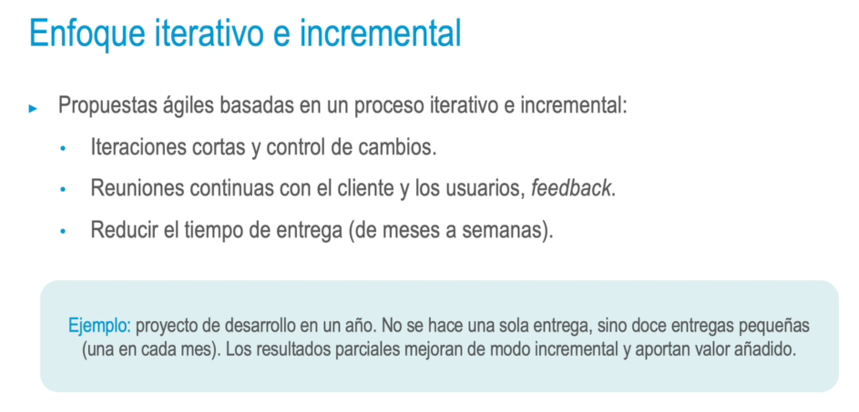
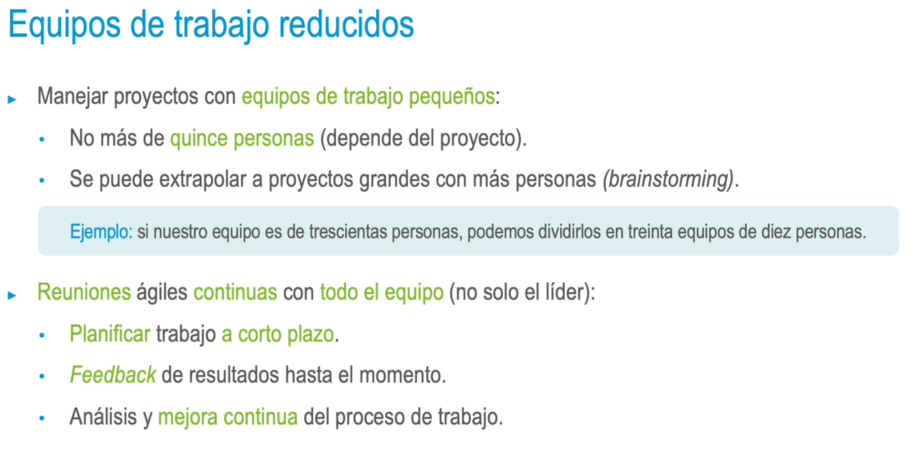

### Valores añadidos en el enfoque ágil
• Mayor grado de **confianza** en el proyecto (resultados parciales tangibles).
• Retorno de inversión rápido (ROI) - Valor de negocio (posición de la marca).
• Mayor **visibilidad** del proyecto.
• **Disminución** de **riesgo** global desde etapas tempranas.
• Proceso de **adaptabilidad** más sencillo que con el enfoque tradicional.
-
- 
-
- {:height 463, :width 753}
-
- 
-
- ### Retorno de inversión temprano
  • Resultados parciales en cada iteración:
  • Obtención de un **ROl** en fases iniciales del proyecto.
  • No solo ganancias dinerarias, también proyecto **sin retraso ni errores.**
  • **Validación** del **trabajo** desarrollado hasta el momento, no de su utilidad.
  • **Producto mínimo viable** (MVP, minimum viable product) por iteración y plazos cortos.
-
- 
-
- ### Reducción de riesgos por entrega
  • La propuesta ágil reduce los riesgos en cada entrega:
  • Los usuarios finales pueden ver avances y resultados parciales.
  • Se evita el enfoque clásico basado en hitos.
  • Permite recabar feedback en cada entrega.
  • Es posible adaptarse a los cambios en las prioridades de los clientes.
  <ins>Ejemplos: desarrollo de una web, proyecto de call center, servicio de un restaurante, tienda de ropa, etc.</ins>