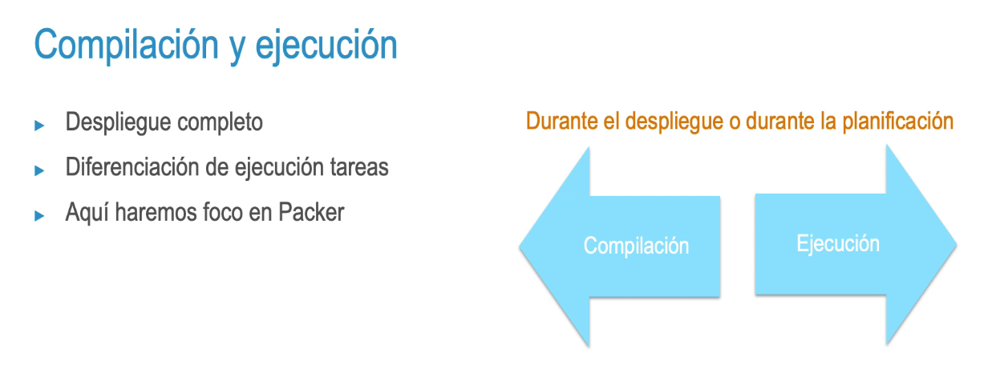
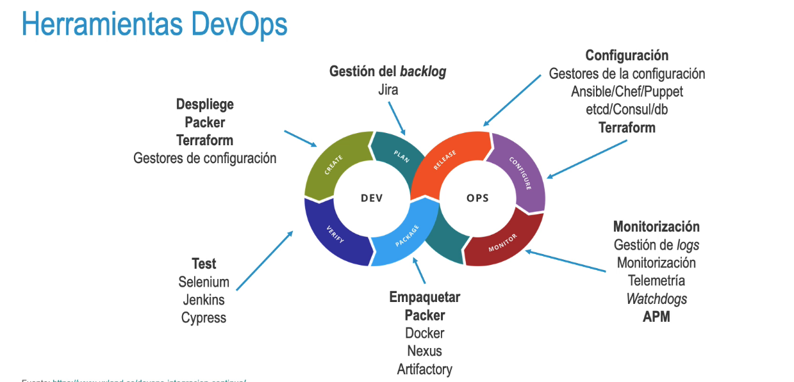
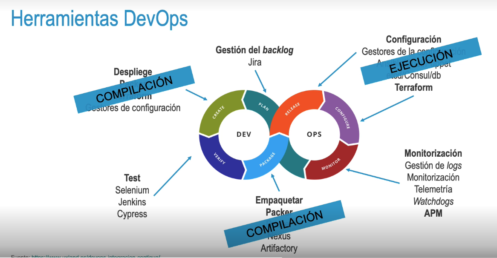
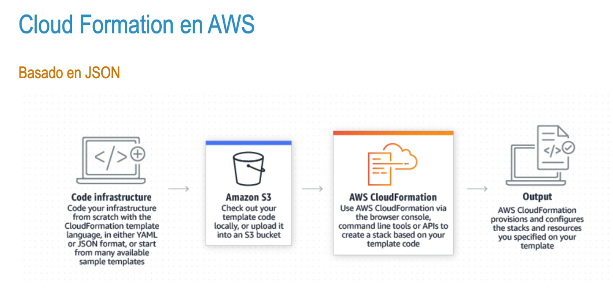
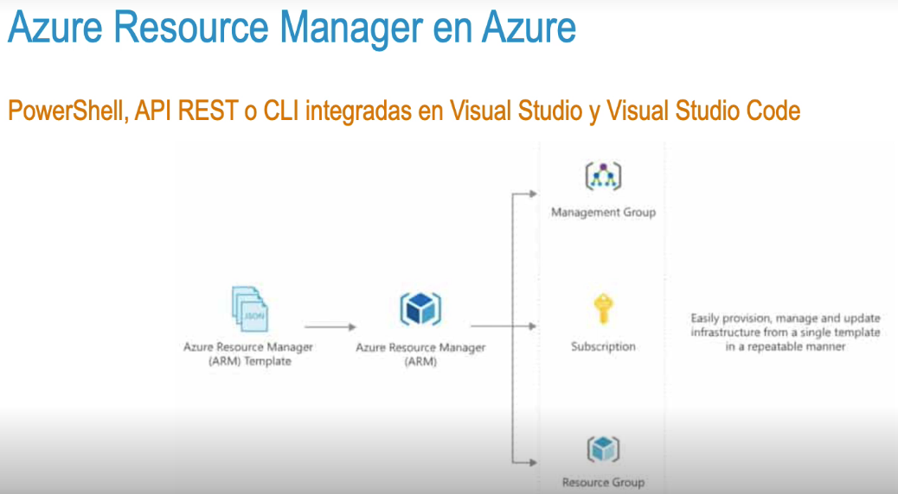
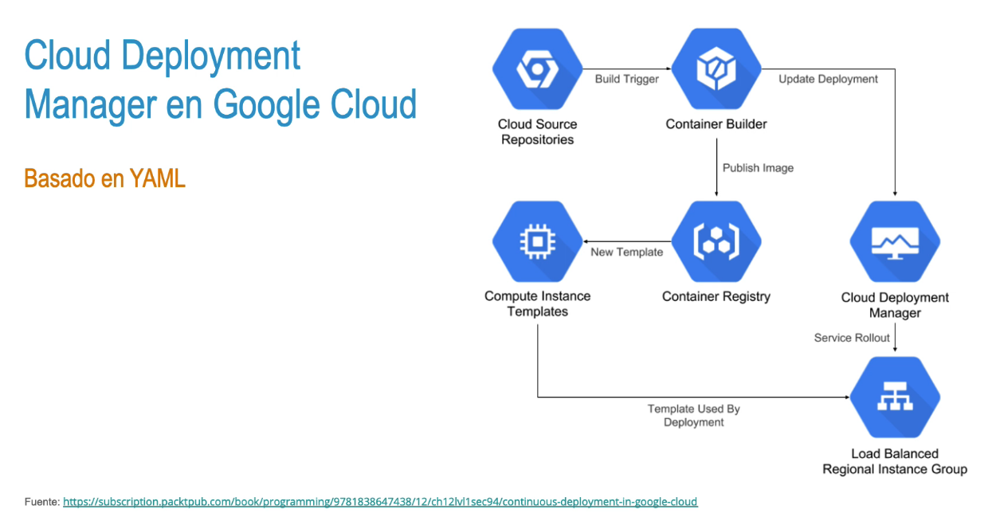

- Etapa de implementación y despliegue
  • Fase en la que implementamos una nueva versión de nuestra aplicación al entorno productivo.
  • Despliegue completo.
  • Dentro de la asignatura, nos focalizaremos en herramientas como Packer y Terraform.
  • Foco dentro de esta fase:
  • Complicación y ejecución.
  • Infraestructura como código.
- Compilación y ejecución 
  • Despliegue completo 
  • Diferenciación de ejecución tareas 
  • Aquí haremos foco en Packer 
  Durante el despliegue o durante la planificación
- 
-
- 
- 
-
- ### Infraestructura como código (laC)
- Tratamiento de elementos físicos como pueden ser servidores, bases de datos, redes u otros relacionados con la infraestructura como software.
- • Ventajas: 
  • Automatización 
  • Velocidad 
  • Ahorro de costes Reducción de riesgo
- • Debido a los beneficios que aporta, las diferentes nubes han implementado soluciones nativas que soportan la la con lenguajes propios:
- • Cloud Formation en AWS 
  • Azure Resource Manager en Azure 
  • Cloud Deployment Manager en Google Cloud
- 
- 
- 