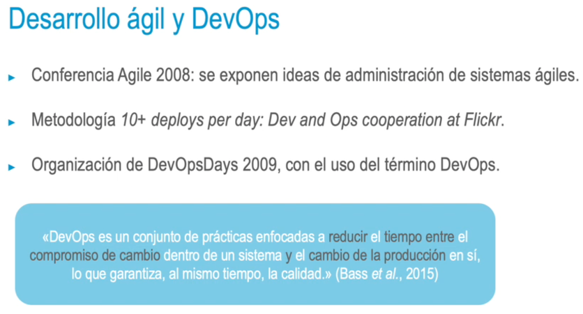
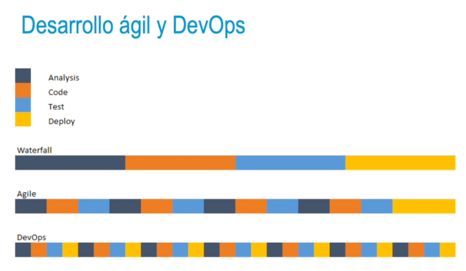

### Desarrollo ágil y DevOps
El origen de DevOps está muy ligado a las metodologías ágiles:
• Principios s. XXI: necesidad de disponibilidad continua en web populares (Google, Flickr), demanda
de ingenieros de fiabilidad software (SRE, software realiability engineer).
• SRE responsables en sector operaciones. Trabajan en equipo con desarrolladores app y garantizan
que los sitios web puedan seguir funcionando tras el lanzamiento del código en fase de producción.
-
- 
- Desarrollo ágil y DevOps
  • Éxito actual del desarrollo software ágil: surge la necesidad de DevOps.
  • Objetivo de las organizaciones: poner en marcha software de manera más rápida y continua.
  • Retos:
  • Procesos de gestión de versiones.
  • Adopción de patrones de automatización de despliegue de aplicaciones.
  Herramientas de integración y entrega continua.
- El movimiento DevOps no solo cambia el método de gestión en el ciclo de desarrollo software en
  términos tecnológicos, sino también de cultura organizacional. Con respecto al enfoque tradicional,
  aporta diversos beneficios:
  • Procesos más ágiles y seguros.
  • Mayor garantía de calidad y fiabilidad del producto final.
  • Menor coste.
  • Más rapidez.
- 
- ### Similitudes y diferencias entre desarrollo ágil y DevOps
  Los términos «ágil» y «DevOps» confluyen al ponerlos en práctica conjuntamente. No obstante, son dos
  conceptos distintos que no deben confundirse.
  • Principal similitud: ambos paradigmas persiguen un objetivo común.
  • Tratan de acelerar procesos de desarrollo y distribución de software.
  • Promueven una buena organización.
  • Fomentan el trabajo colaborativo.
- Los términos «ágil» y «DevOps» confluyen al ponerlos en práctica conjuntamente. No obstante, son dos
  conceptos distintos que no deben confundirse.
  • Principal diferencia: equipos de trabajo.
  • El enfoque ágil es una filosofía de apoyo a la construcción de proyectos desarrollados por equipos
  pequeños, con adaptación a los cambios durante el proceso.
  • El paradigma DevOps es una metodología que une equipos de desarrollo y operaciones o
  sistemas, que estaban separados y entre los que no existía comunicación.
- Son paradigmas compatibles. La combinación de ambos hace que las empresas aceleren de manera
  muy considerable sus proyectos de ingeniería de software.
  • El uso de agilismo y DevOps seguirá en crecimiento dentro del sector de desarrollo SW.
  • Para avanzar profesionalmente en el sector, será crucial el dominio de ambos.
- Principios DevOps
  Algunos métodos y enfoques del paradigma ágil son comunes en DevOps:
  • Facilitar, acelerar y mejorar el desarrollo y despliegue de productos (scrum, kanban).
  • Emplear cadenas de herramientas adaptadas a metodologías ágiles.
  Optimizar y automatizar las diferentes fases del desarrollo de proyectos.
- DevOps incluye principios o prácticas implementados en diferentes fases del desarrollo de un proyecto y
  que reflejan su base de automatización y mejora continua:
  • Desarrollo continuo
  • Realización de pruebas continuas
  • Integración continua
  • Entrega continua
  • Puesta en marcha continua
  • Supervisión continua
  • Infraestructura como código
- Ventajas DevOps
  Los principios en los que se basa DevOps proporcionan ventajas técnicas y empresariales:
  • Entrega de productos de mejor calidad y de una forma más rápida.
  • Resolución de problemas con menor complejidad y en un tiempo más acotado.
  • Mayor disponibilidad y escalabilidad.
  • Mayor estabilidad en los entornos de funcionamiento.
- • Utilización de recursos más adecuada.
  • Automatización en la mayoría de los procesos
  • Resultados del sistema más visibles.
  • Mayor innovación en el proyecto.
- ### Roles, habilidades y responsabilidades de los ingenieros DevOps
  • Responsabilidad sobre la producción y el mantenimiento continuo de la plataforma de una aplicación
  de software.
  • Capacidad para solucionar problemas del sistema y en los dominios de la plataforma y las
  aplicaciones.
  • Gestión eficaz de proyectos a través de plataformas abiertas y basadas en estándares.
  • Mejora de la calidad del proyecto.
- •  Reducción de los costes de desarrollo mediante la colaboración.
  •  Aumento de la visibilidad y la trazabilidad del proyecto.
  • Análisis, diseño y evaluación de sistemas de automatización y uso scripts.
  • Resolución de problemas críticos en los sistemas a través del uso de los mejores servicios de
  soluciones de seguridad en la nube.