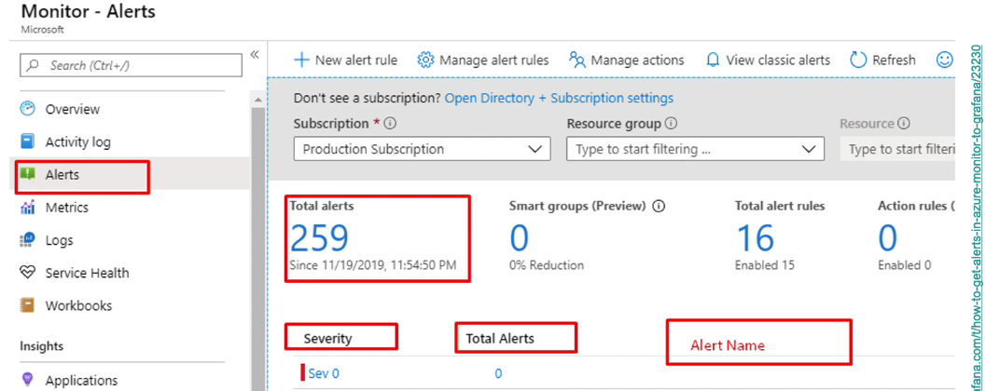

- 
-
- Supervisión y recopilación de datos
- • Logs: saber qué ha pasado. 
    • Monitorización: visibilidad completa. 
    • Métricas: proporciona datos sobre porcentajes, usos, etc. 
    • Alertas: comunicación a los usuarios. 
    • APM: monitorización de rendimiento.