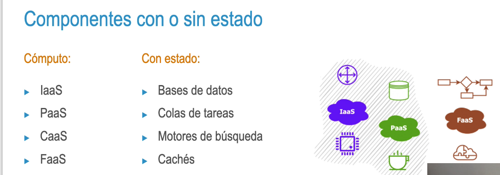
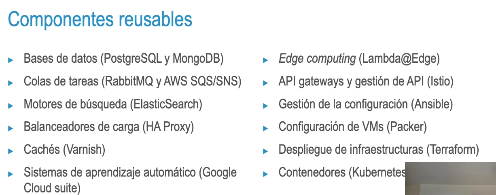

- 2.1 Tipos de Componentes
- ¿Qué es un componente? En el marco de DevOps, un componente se define como una pieza desplegable. Podemos dividirlo atendiendo a dos variables:
  • Según si tienen o no estado. 
  • Según si son o no reusables entre proyectos.
- 
- 