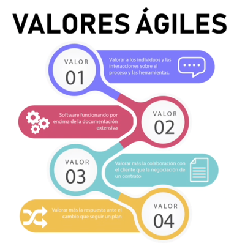
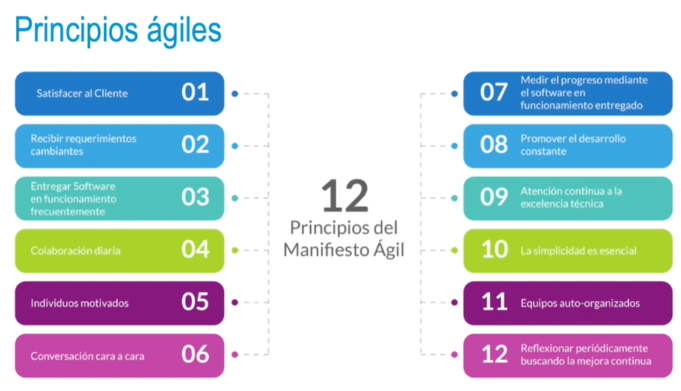

### El Manifiesto Ágil
• El principal objetivo del Manifiesto Ágil era establecer un conjunto de valores y principios.
• Guía o modelo a seguir para alcanzar un desarrollo de software de calidad, rápido y adaptado a
requisitos cambiantes.
• Algunos de esos aspectos no eran novedosos, pero fueron aglutinados y junto con otros aspectos
plasmados y sintetizados en el Manifiesto.
- 
-
- 
- ### Consideraciones sobre los valores y principios ágiles
  • Ausencia total de documentación.
  • Ausencia total de planificación.
  • El cliente hace todo el trabajo y adopta el rol de jefe de proyecto.
  • El equipo de trabajo cambia de metodología sin justificación.
- • En proyectos estables con organizaciones rígidas, es probable que les interese adoptar metodologías tradicionales
  • En organizaciones más flexibles con proyectos cambiantes por el tipo de tecnología o mercado, puede interesar el uso de metodologías ágiles
  • En proyectos cambiantes con organizaciones rígidas, se pueden considerar métodos iterativos formales.
  • En organizaciones más flexibles con proyectos estables, se pueden considerar los métodos ágiles optimizados.