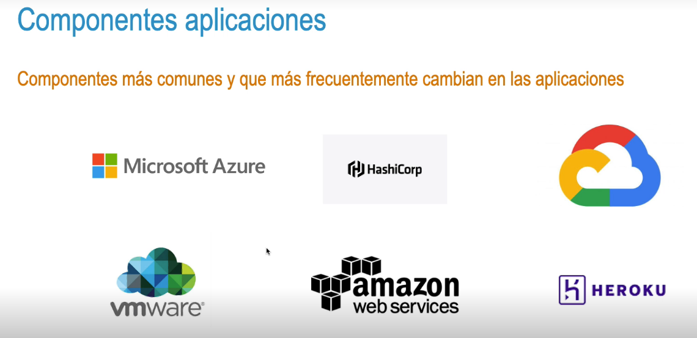
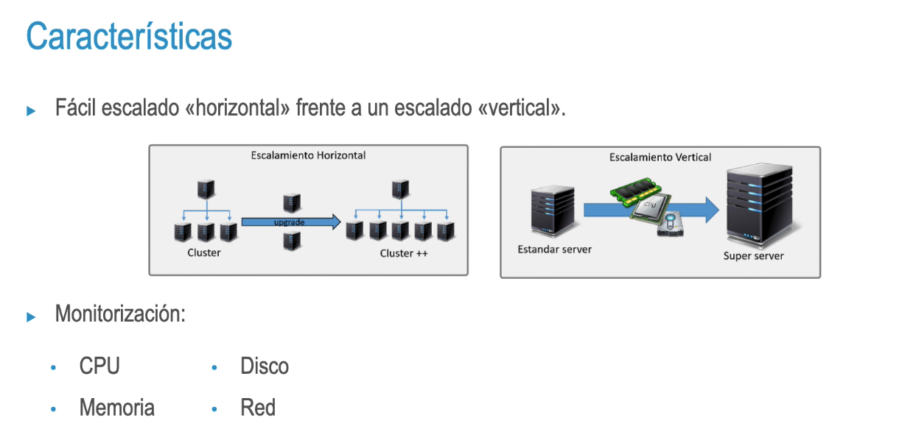
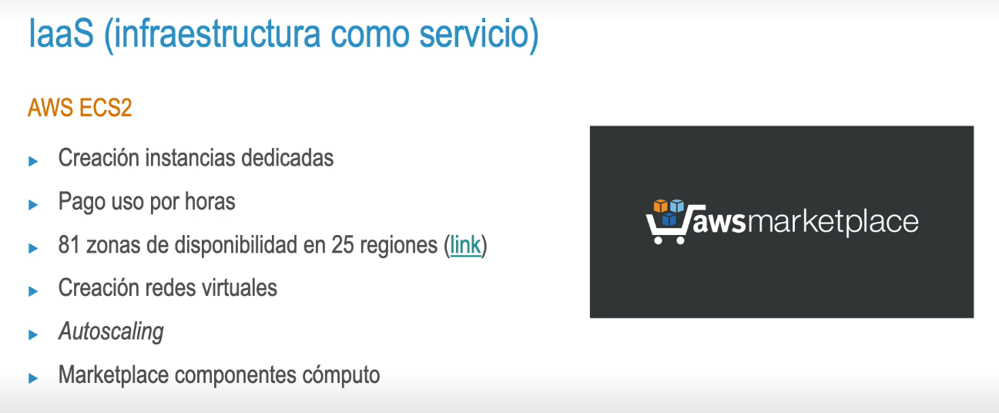
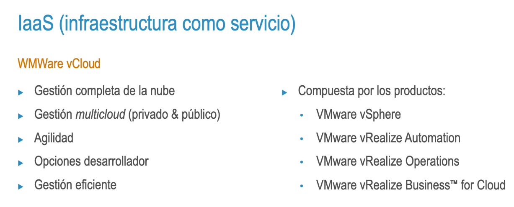
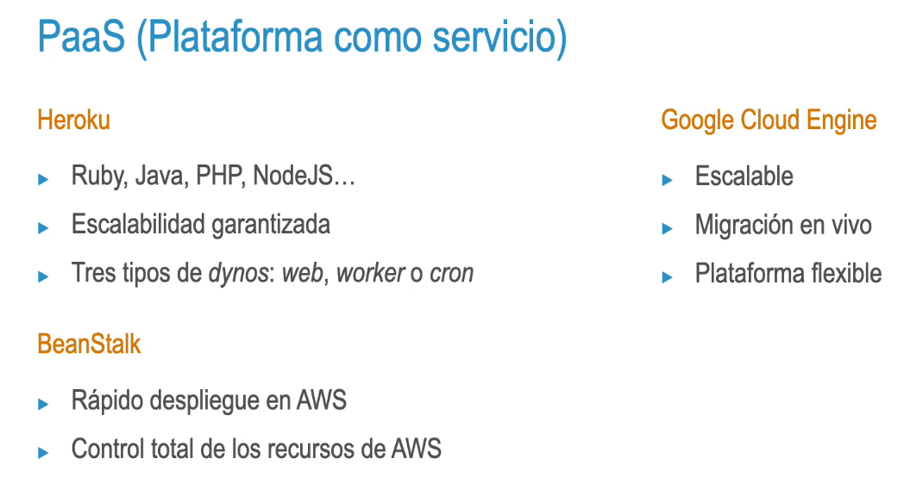
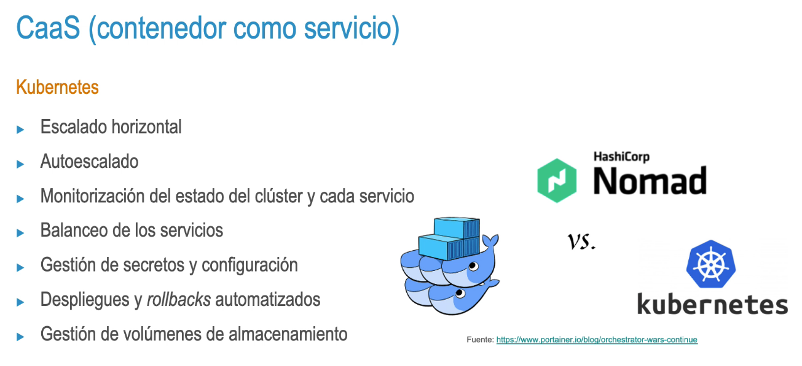
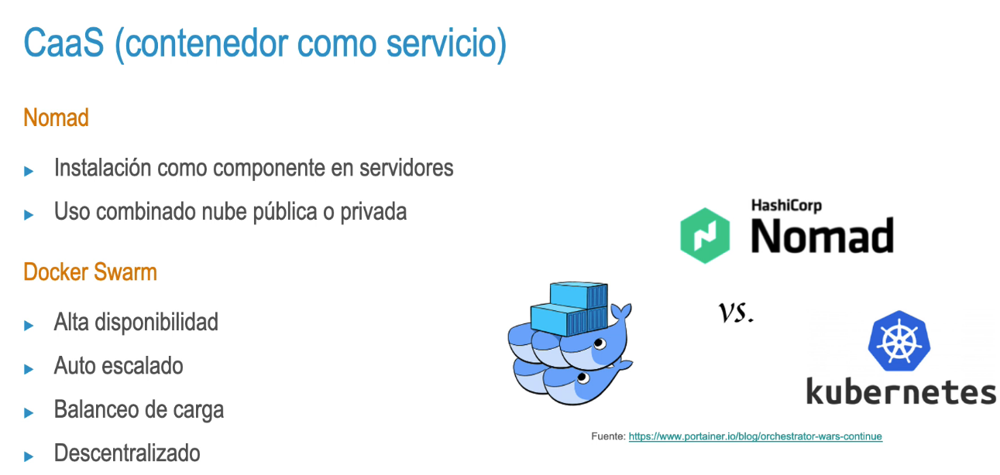

- 
- 
- laaS (infraestructura como servicio)
- • Tecnología básica para obtener cómputo en la nube 
  • Menor coste 
  • Packer 
  • Monitorización obligatoria 
  • Necesidad de orquestación incluso en servidores físicos
- 
- 
- {:height 441, :width 778}
- 
- 