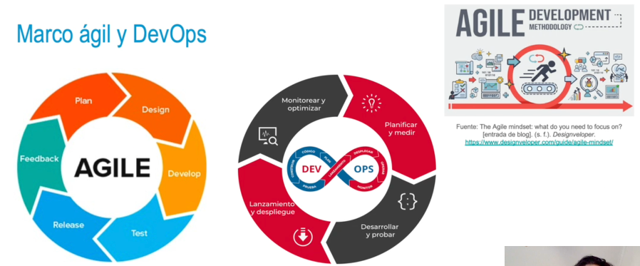
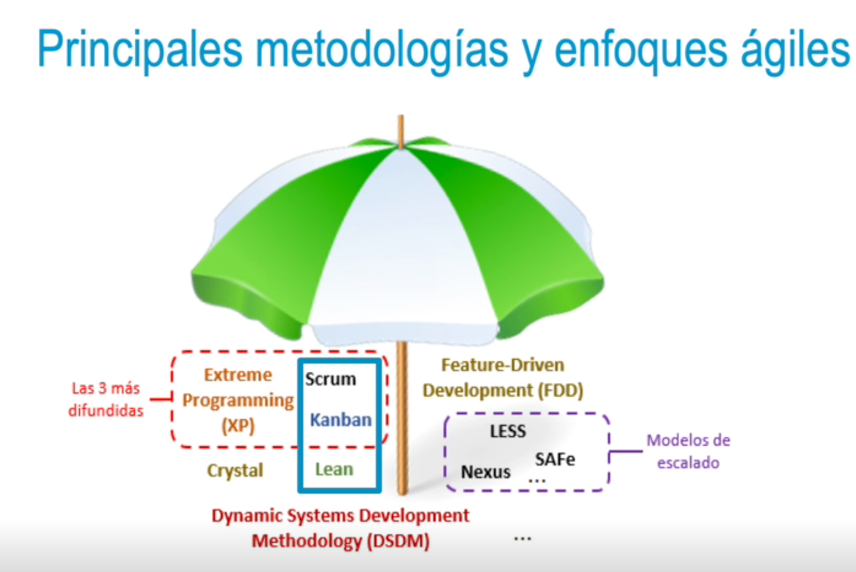
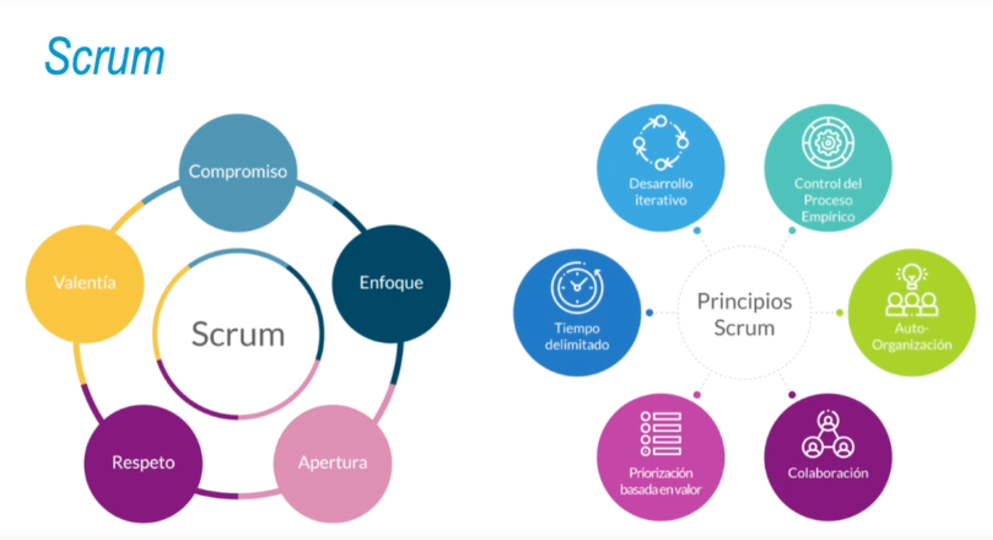
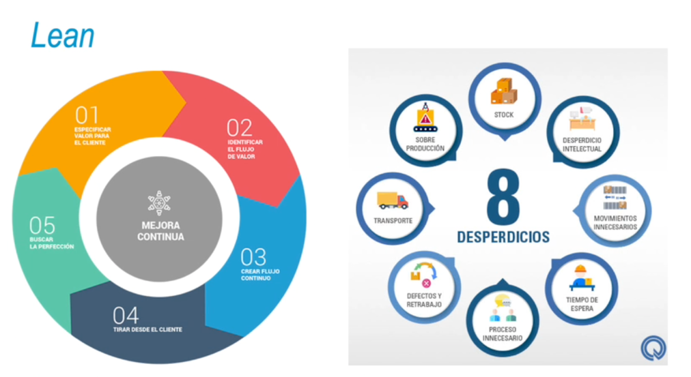
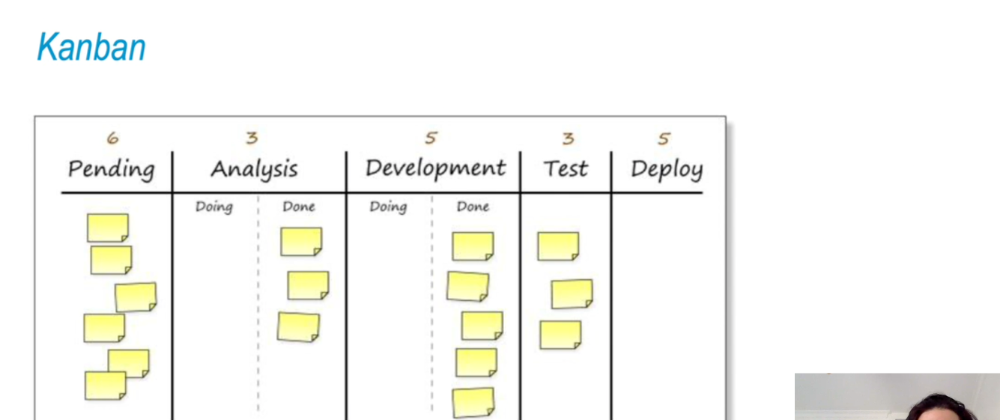

- 
- Metodologías y enfoques ágiles
  • El enfoque ágil para la gestión de proyectos es una buena decisión a la hora de afrontar proyectos
  que van a estar sometidos a cambios continuos.
  • El enfoque tradicional también continúa usándose, no ha pasado de moda.
  • Es necesario conocer bien las fortalezas y debilidades de cada uno de los paradigmas para aplicar el más adecuado en función de cada proyecto y situación.
  • Existen multitud de metodologías que poner en práctica según las necesidades de cada organización y proyecto.
- •  El paradigma ágil se percibe como una ventaja competitiva organizacional.
  • Las empresas actuales con mayor éxito mundial, principalmente en el sector de la tecnología, están
  adoptando el enfoque ágil.
  Existen multitud de metodologías y de enfoques ágiles, tantos como organizaciones que puedan
  llevar a cabo un ajuste propio del método específico empleado.
- {:height 532, :width 773}
-
- ## Scrum
  • Scrum es la metodología ágil más conocida, sencilla y, a la vez, genérica.
  • Scrum es ligero y fácil de entender, aunque también puede ser difícil de dominar
  >Aprendizaje empírico a corto plazo
  • Aprendizaje iterativo: mejorar la versión del producto.
  • Aprendizaje incremental: incluir nuevas funcionalidades en períodos cortos
- >Sus principios cumplen con los del manifiesto ágil:
  • Resultados de manera rápida y transparente, con revisiones.
  • Fácil comunicación y adaptación a cambios de requisitos.
- 
-
- ### Lean
  • Lean no es una metodología, sino un conjunto de principios o pensamientos, una filosofía:
  Valor y calidad que se ofrece al cliente.
  • Eliminación del desperdicio, mejora continua, procesos según demanda del cliente (pull).
  Flexibilidad y relación a largo plazo con proveedores.
  • Maximizar el valor de negocio dado al cliente al tiempo que se reducen los recursos.
  • Desafío de identificación del flujo de valor, conjunto de acciones críticas:
  • Solución de problemas.
  • Gestión de información.
  • Transformación física.
- 
-
- ### Kanban
  • Kanban es un término japonés que se traduce como 'señal en forma de tarjetas visuales'.
  • TPS (Toyota production system), basado en la reposición de supermercados y adaptado a la
  producción y demanda de coches; filosofía lean just-in-time:
  • Aumento de la productividad.
  • Eliminación de despilfarros.
  En 2009, se comienza a aplicar el sistema kanban para el desarrollo de
  software con enfoque lean.
- 
-