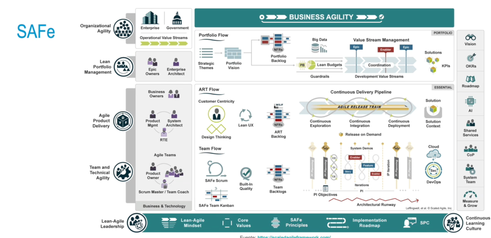
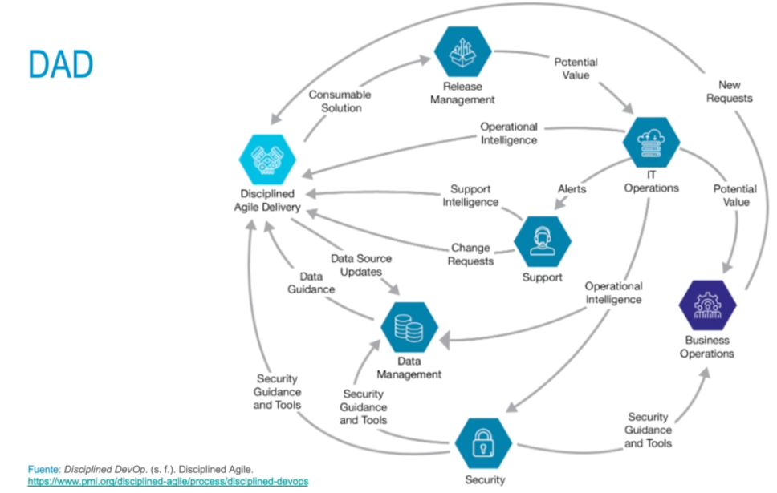
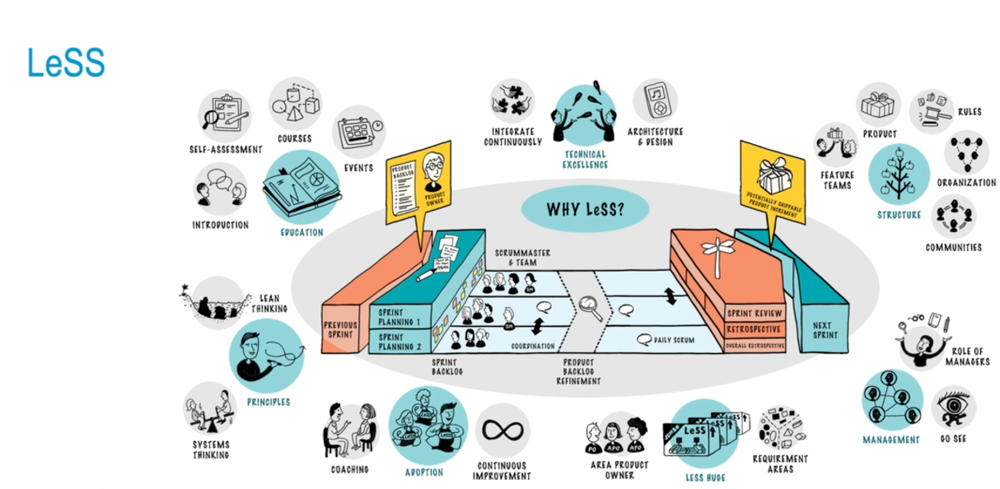
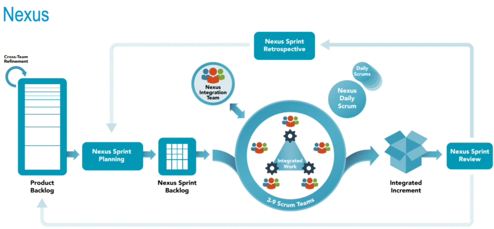

### Necesidad de uso de los frameworks de escalado ágil
En las grandes organizaciones, algunos aspectos no se resuelven tras aplicar metodologías o enfoques ágiles como scrum. Para solventar estas dificultades, surgen los frameworks de escalado ágil:
• Scaled Agile Framework (SAFe)|
• Disciplined Agile Delivery (DAD)
• Large Scale Scrum (LeSS)
• Nexus
- 
-
- 
- 
- 
-