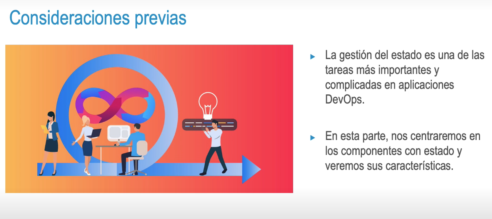

- 
- 
- ### Base de datos
- • Componente importante por su impacto 
  • Valoración previa 
  • Clasificación de las BB. DD.
  • Tipo de contenido 
      • OLAP 
      • Data warehouse
- • Tipo de interfaz 
    • SQL 
    • Orientadas a documentos Orientada a grafo 
    • Orientadas a columnas
- 
- ### Colas de mensaje
  • Distribuir mensajes entre diferentes componentes
- • Beneficios: 
  • Garantía de entrega 
  • Redundancia 
  • Desacoplamiento 
  • Escalabilidad
- • Patrones de consumo:
     • Colas de trabajo 
     • Pub/sub 
     • Enrutado sofisticado 
     • Llamada a procedimiento remoto
- 
- 
- 
- ### Información de ejecución y sesión 
  • Parte de una tarea de larga duración 
  • # Caché 
  • Gran impacto en la pérdida de información 
  • Tratamiento especial
- • Herramientas para tratar este tipo de información: 
    • Redis 
    • MongoDB
- 