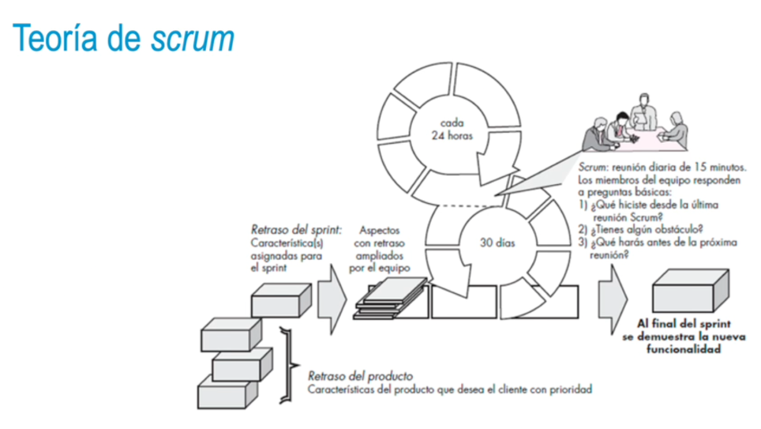
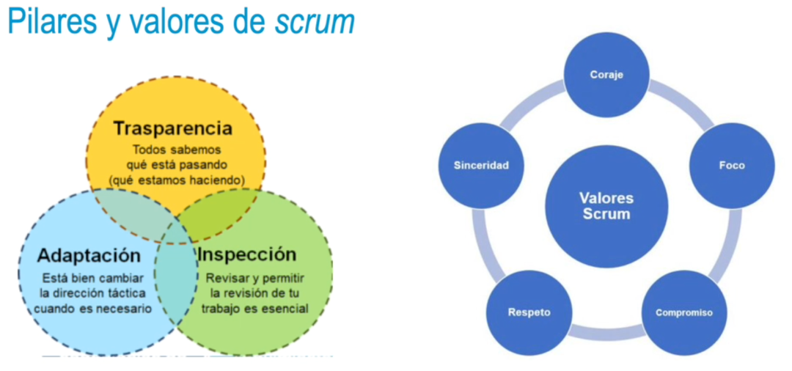

### Teoría de scrum
• Marco de trabajo para la gestión de proyectos basado en el manifiesto ágil; trabajo colaborativo.
• Autogestión (antes más autoorganización).
• Aprendizaje empírico:
• Iterativo: mejorar producto a corto plazo.
• Incremental: incluir nuevas funcionalidades.
- • Basado en el pensamiento lean → reduce desperdicios, se centra en lo esencial.
  • Objetivos: lograr resultados de manera rápida y facilidad de adaptación a los cambios.
  * Desarrollo SW: selección de una metodología de trabajo adecuada.
  • Scrum se usa en proyectos con entregas a corto plazo, susceptibles de sufrir cambios.
  • Desarrollo flexible, basado en iteraciones y entregas periódicas.
- • Conjunto de **buenas prácticas**. Posibles **errores de aplicación**:
  • No colaboración cliente - equipo desarrollo
  • No valoración apropiada de personas del equipo
  • Equipo no maduro
  • Falta de liderazgo
  • Falta de empatía participantes (stakeholders)
- 
- • **Backlog**. Incluye el product backlog y sprint backlog:
  • Lista funcionalidades del sistema prioritarias.
  • Se pueden incluir nuevas funcionalidades.
  • **Sprint:**
  • Una unidad de trabajo para implementar una funcionalidad del sprint backlog.
  • Suele durar un mes máximo, sin que se produzcan cambios durante el sprint.
- • **Daily scrum:**
  • Reuniones cortas diarias, de quince minutos, de pie.
  • Encontrar problemas potenciales, socializar y promover autonomía.
  • Demostraciones preliminares.
  • Iteración con incremento de software y entrega al cliente para validación.
- 
-