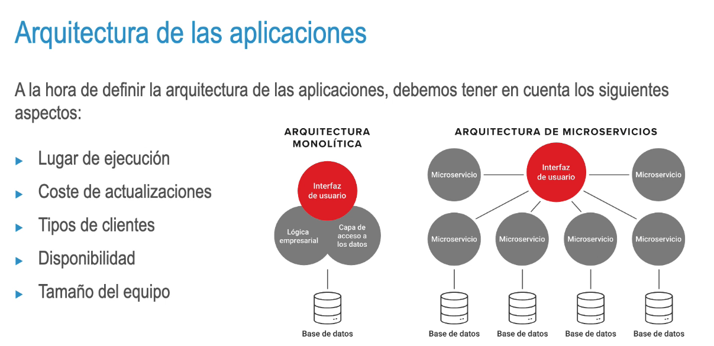

### Arquitectura de las aplicaciones
Las aplicaciones son **piezas desplegables** que **cubren** una **necesidad**. Se dividen en:
• Librerías
• Aplicaciones de escritorio
• Aplicaciones web
* Entornos embebidos
• API REST
- 