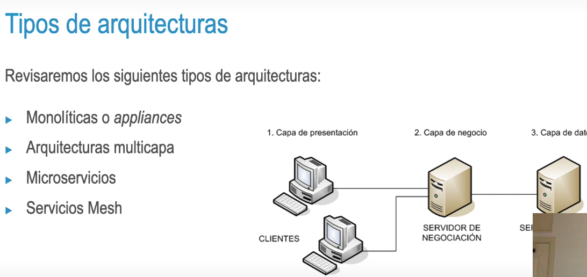

### Diseño de la arquitectura
El diseño de la arquitectura del software debe dar **respuesta tanto** a los **requisitos funcionales** como a los **no-funcionales**, tales como:
• Autonomía
• Escalabilidad
• Fiabilidad
• Mantenimiento
• Resiliencia
- 