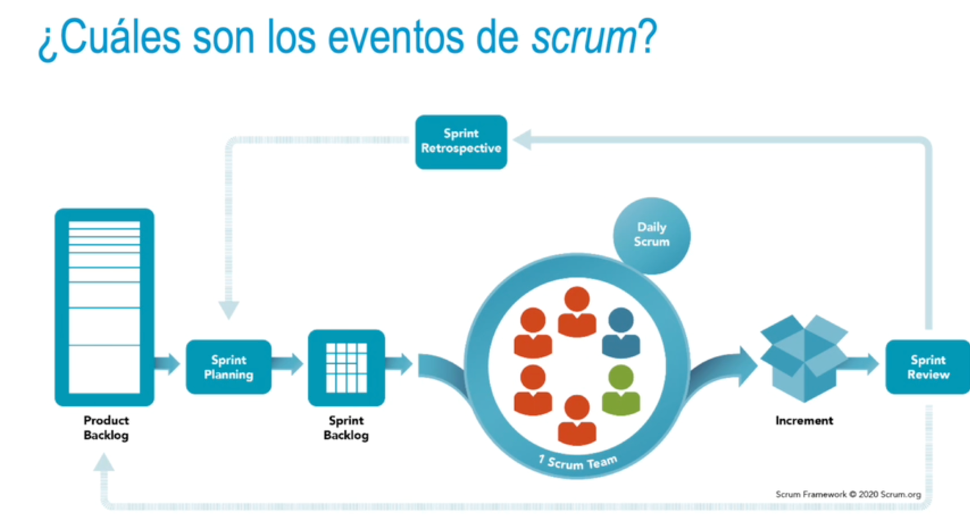
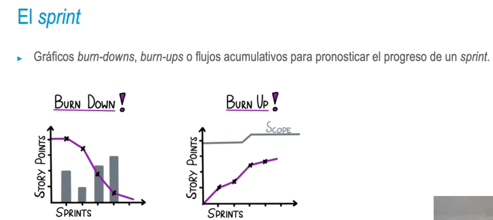
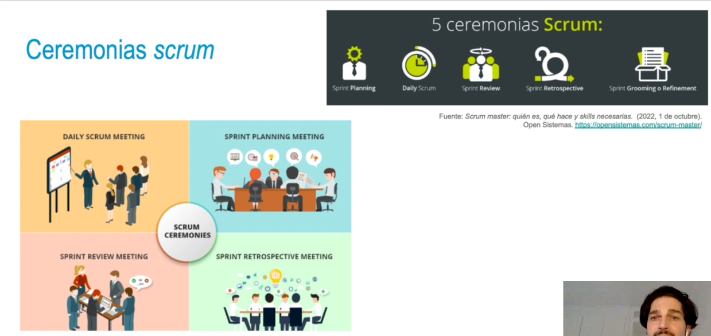
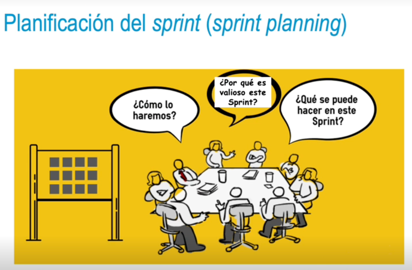
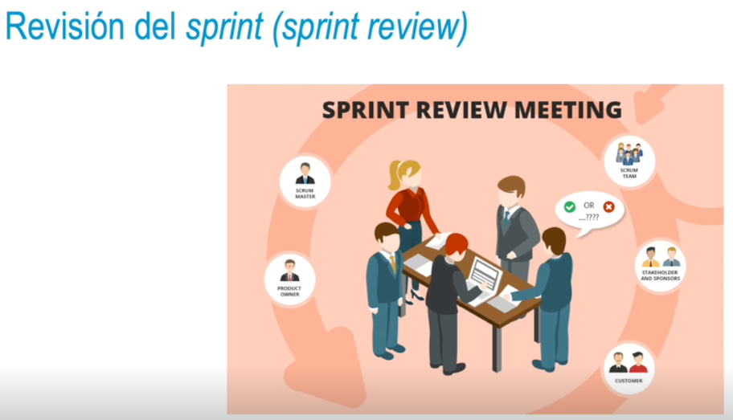
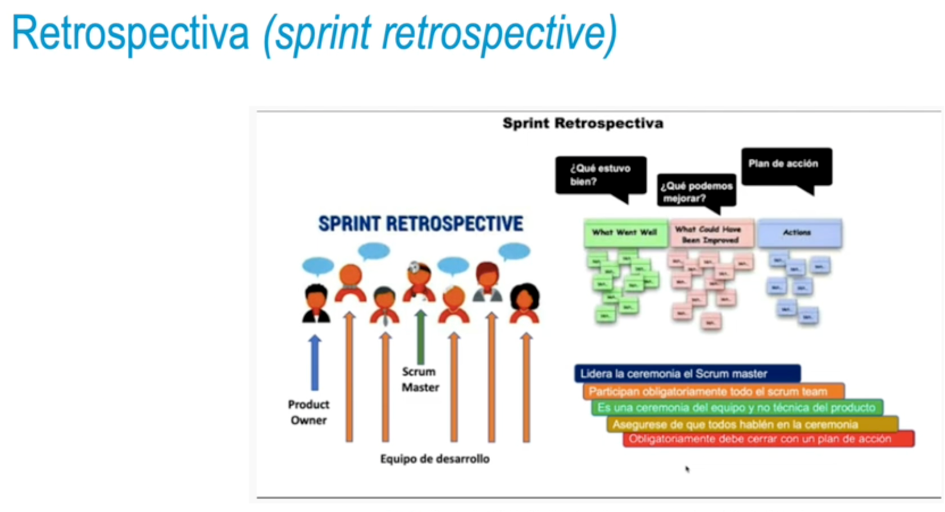

### ¿Cuáles son los eventos de scrum?
• Los eventos se vinculan a las reuniones que se llevan a cabo durante un proceso. Cuando se definen
de forma correcta, permiten inspeccionar y adaptar los artefactos de scrum → transparencia.
• Se usan para alcanzar una regularidad y minimizar el número de reuniones no definidas.
• Lo óptimo es realizar todos los eventos al mismo tiempo y en el mismo lugar para reducir la
complejidad.
• Sprint como contenedor de otros eventos: planificación sprint, scrum diario, revisión sprint y
retrospectiva sprint.
- 
- ### El sprint
  • Es un **evento base** de scrum a través del cual las **ideas** se convierten **en valor**.
  • En él, se lleva a cabo el trabajo para alcanzar el objetivo del producto (product goal).
  • Permite la previsibilidad y asegura la inspección y la adaptación del progreso.
  • Posee una longitud fija, con una duración de un mes o menos para crear consistencia.
  • Al finalizar un sprint, se comienza el siguiente de forma inmediata.
- • Cada sprint se puede considerar como un proyecto corto:
  • Si un sprint es muy largo, puede que el objetivo sprint (sprint goal) quede obsoleto.
  • Si el objetivo sprint queda obsoleto, el product owner podría cancelarlo.
  • Sprints cortos limitan el riesgo de coste y el tiempo de esfuerzo.
- 
- {:height 282, :width 580}
- ### Planificación del sprint (sprint planning)
  • Implica, para el equipo scrum, iniciar el diseño del trabajo.
  • El product owner debe asegurar que las personas implicadas estén preparadas para discutir sobre los
  elementos de trabajo importantes y asignar el objetivo producto.
  • El equipo scrum puede invitar a otras personas para recibir su asesoramiento.
  • Esta fase tiene una duración máxima de ocho horas (o incluso menos) para un sprint de un mes.
- 
- ### Scrum diario (daily scrum)
  • Es una reunión diaria para inspeccionar el progreso del objetivo sprint y adaptar el sprint backlog.
  • Participan los desarrolladores del equipo scrum; el product owner y el scrum master pueden estar
  pendientes.
  • Objetivos: reducir la complejidad, mejorar la comunicación, tomar decisiones rápidas, adaptar el
  trabajo pendiente del sprint.
  Duración máxima de quince minutos.
- #### Revisión del sprint (sprint review)
  • El sprint review tiene el objetivo de inspeccionar el resultado del sprint para determinar futuras
  adaptaciones.
  • El equipo scrum presenta los resultados a los stakeholders y se discute cómo avanzar hacia el
  objetivo del producto.
  • Hay que ajustar el trabajo pendiente del producto si se requieren nuevos requisitos.
  • Duración máxima de cuatro horas para un sprint de un mes; menos si el sprint es menor.
- 
- #### Retrospectiva (sprint retrospective)
  • Tiene como propósito planificar maneras de aumentar la eficacia y calidad.
  • El equipo scrum inspecciona cómo fue el último sprint respecto a individuos, interacciones, procesos,
  herramientas y definición de hecho.
  • Se identifican aquellos cambios útiles para mejorar la eficacia.
  • Duración máxima de tres horas para un sprint de un mes, menos tiempos en sprints más cortos.
- 
- #### Refinamiento (sprint refinement)
  * El sprint refinement se recomienda para asegurar que el product backlog está siendo preparado.
  • Es responsabilidad del product owner el agendar, gestionar y dirigir esta reunión.
  • Los participantes son todo el equipo scrum y cualquier recurso adicional que pueda contribuir a
  aclarar los requisitos o historias de usuario.
  • Duración máxima de dos horas por semana del sprint.
-