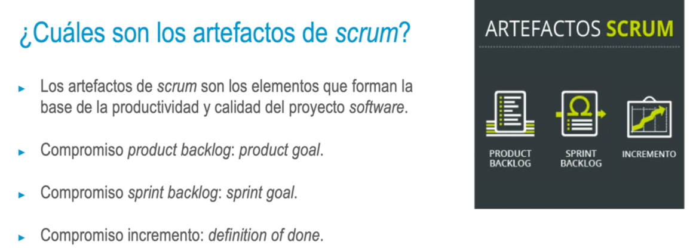
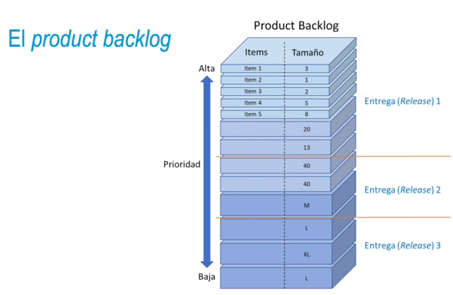
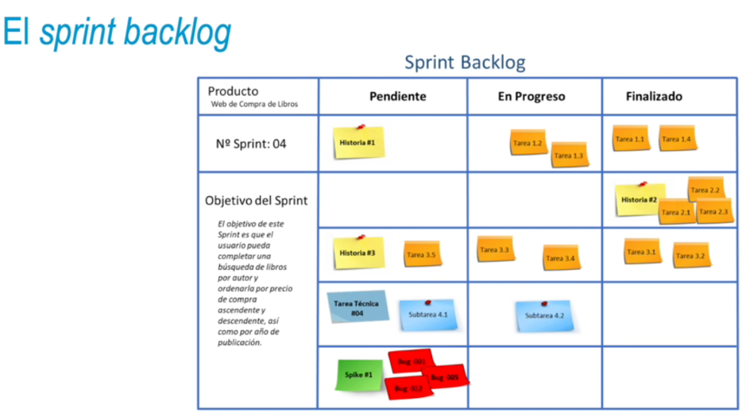
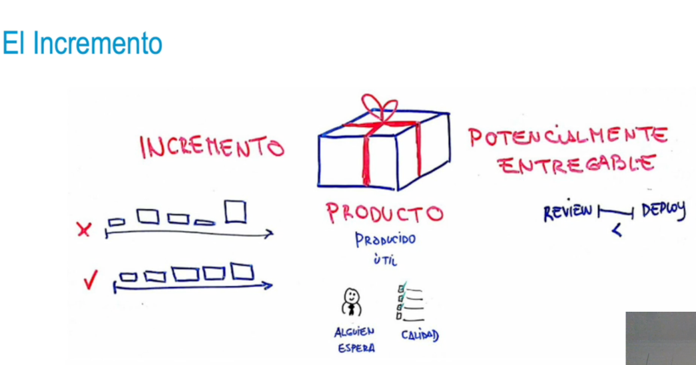
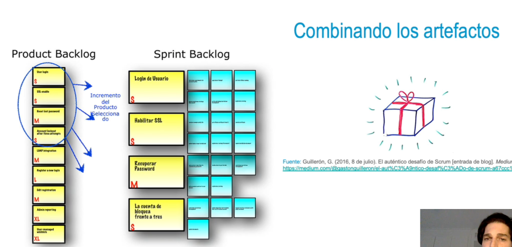

- 
- ### El product backlog
  • El product backlog es un listado de requisitos.
  • Nivel de detalle.
  • Estimación y planificación.
  • Funcionalidades emergentes.
  • Priorización.
- {:height 386, :width 580}
- ### El sprint backlog
  Es la pila de elementos de producto pendientes.
  • Se trata de un plan diseñado por y para los desarrolladores, pues representa el trabajo que han de
  llevar a cabo para para alcanzar el objetivo sprint.
  • Debe tener suficientes detalles para inspeccionar el progreso en la daily scrum.
  • Se actualiza a lo largo del sprint, conforme se aprende más.
- 
- ### El incremento
  • Dentro de un sprint, se pueden crear varios incrementos.
  • La suma de incrementos se presenta en la sprint review.
  • Un incremento puede ser entregado a los stakeholders antes de finalizar un sprint.
  • El trabajo no se podrá considerar parte de un incremento si no cumple la definición de hecho
  (definition of done).
- 
- 