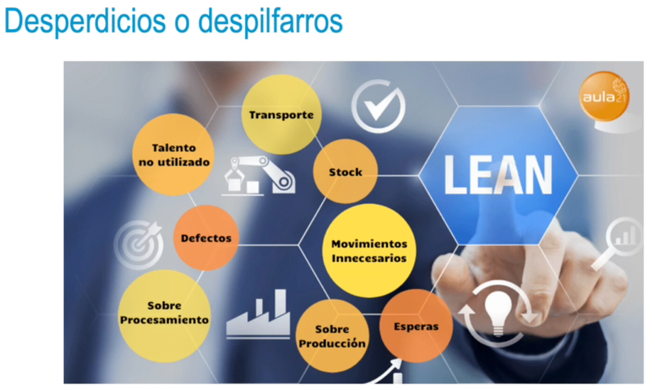

### Concepto y objetivo de lean
• Lean: maximizar el valor que se da al cliente y reducir desperdicios.
• Identificar el flujo de valor para el cliente o conjunto de acciones necesarias para llevar un producto
específico a través de las tareas criticas de gestion de una empresa:
• **Solución de problemas:** concepción del producto, diseño e ingeniería, producción.
• **Gestión de la información:** recepción del pedido y entrega.
• **Transformación física:** desde las materias primas hasta que el producto es finalizado y entregado
al cliente.
- • Es fácil de pensar, pero difícil de poner en práctica:
  • Identificar desperdicios, ineficiencias (personal, material, tiempo, maquinaria, coste...).
  • Reducirlos o eliminarlos.
  • Evitar la «parálisis por análisis» o el «síndrome de la hoja en blanco».
- ### Lean management
  Lean management es una gestión de implantación lean que define la estrategia de eficacia operativa de una empresa y que busca aprovechar los recursos de forma eficiente.
  • Producir más con menos: productos con calidad y costes reducidos.
  • Evitar gastos, errores y procesos lentos: se eliminan agentes, procesos y herramientas no necesarios durante la fabricación y comercialización del producto.
- ### Lean manufacturing
  Lean manufacturing es un modelo de aplicación lean para la mejora y la optimización de procedimientos de producción. Es decir, trata de eliminar aquellas tareas sin valor:
  • Implantar mejoras con recursos mínimos.
  • Aplicar técnicas y herramientas a los procesos de producción.
- 
-
-