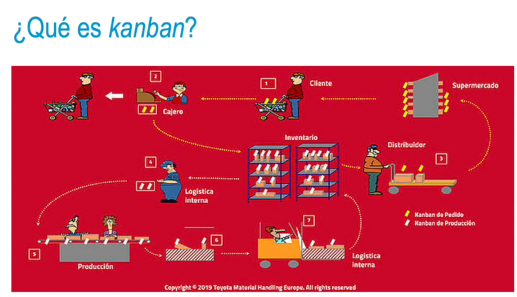
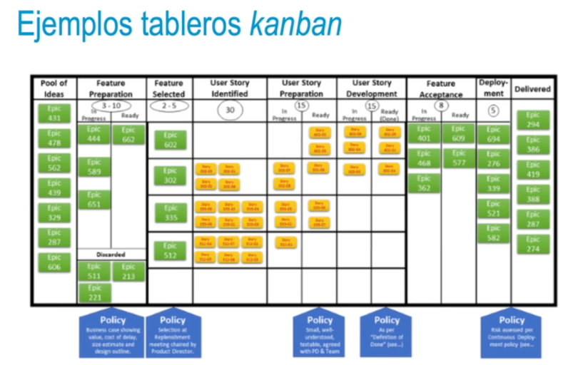

- 
-
- ### ¿Qué es kanban?
  • Primera aplicación del sistema kanban al desarrollo software con fundamentos en el enfoque lean just-in-time (David Anderson, 2009)
  • Kanban se considera tanto una metodología o conjunto de buenas prácticas como un tipo de herramienta.
  • Desarrollo incremental, uso historias de usuario, tareas, etc.
  • Panel o tablero visual: tablero kanban (físico o digital)
  • Trabajo que se está llevando a cabo o work in progress (WIP)
- 
-