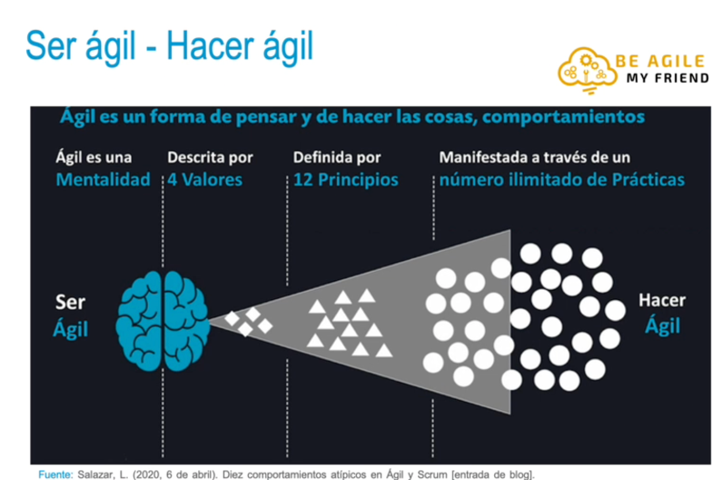
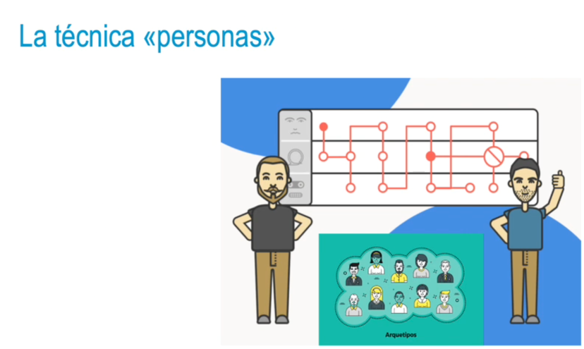
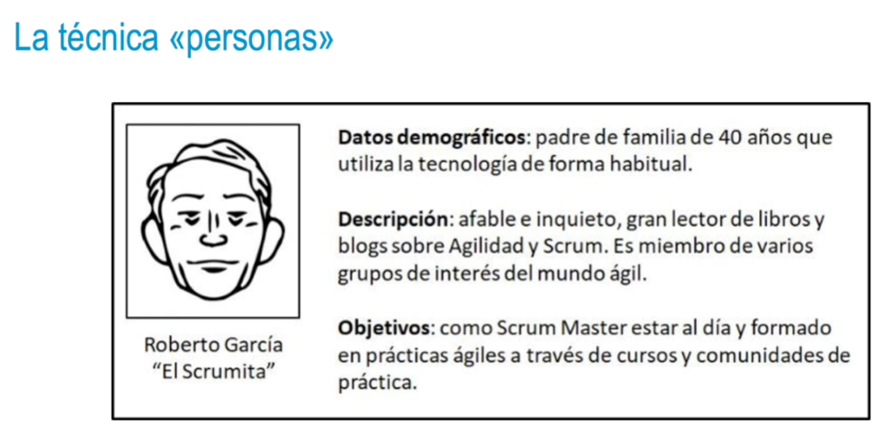

- 
-
- {:height 396, :width 649}
- #### La técnica «personas»
  • Las personas pueden ayudar a los diseñadores de proyectos en tareas como:
  • Definir qué debería hacer un producto y cómo debería comportarse.
  • Establecer comunicación entre las partes interesadas, diseñadores y desarrolladores.
  • Elaborar un consenso y compromiso de diseño.
  • Evaluar mediciones de la efectividad del diseño.
  • Apoyar otros esfuerzos del producto (marketing, ventas).
-
- 
-
- ### Aplicación de la técnica «personas»
  Diseño de modelos de vehículos
  En el sector de automoción, cuando las marcas diseñan vehículos, lo hacen pensando en personas de diferentes segmentos o grupos. En este caso, podría tratarse de un padre de familia, una pareja joven sin hijos o un ejecutivo.
  • En el primer supuesto, un padre de familia que disponga de recursos económicos ajustados necesitará un vehículo práctico y sencillo, con bajo coste y que le permita trasladar a sus hijos con comodidad.
  • En el segundo caso, una pareja joven sin hijos se presupone que realizará desplazamientos de largas distancias para disfrutar diferentes actividades, en vacaciones, fines de semana, al aire libre e incluso con amigos.
  • En el tercer supuesto, un ejecutivo que use el vehículo solo en ciertas ocasiones, para moverse por la ciudad, puede requerir un coche que, de alguna forma, lo represente y lo distinga en su entorno social.