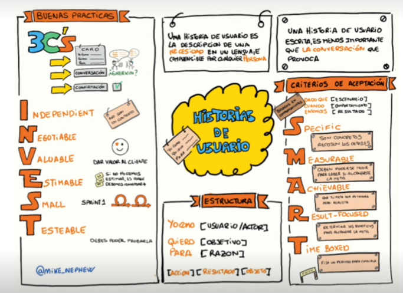

- 
-
- ### Beneficios HU
  • Una historia de usuario es la unidad de trabajo más pequeña en paradigma ágil.
  • Cada historia contiene información suficiente en pocas frases.
  • Se usan para la estimación del esfuerzo (definition of done).
  • Cada historia de usuario suele oscilar entre 1-3 días trabajo.
  • Encajan en metodologías ágiles → scrum, kanban:
  • En scrum, se añaden a los sprints y se van quemando.
  • En kanban, se introducen en el backlog y se ejecutan según el flujo de trabajo.
  • El equipo kanban aprende a gestionar el WIP (work in progress).
  • Sitúan al usuario en el centro de atención.
  • El usuario deposita su confianza en el equipo.
  • Facilitan la colaboración.
  • Impulsan las soluciones creativas.
  • Aumentan la motivación.
-
- 
- 
- 
- {:height 380, :width 649}
- ### Consideraciones para escribir HU
  • Se escriben durante todo el proyecto ágil (taller de redacción inicio proyecto).
  • Si no se escriben correctamente, pueden dar lugar a errores.
  • Se pueden crear con distintos niveles:
  • Épicas: historias demasiado grandes, compuestas de funcionalidades, varias iteraciones.
  • Tema: colección de historias con relación entre ellas.
- 
- 
- 
- 
- 
- 
-