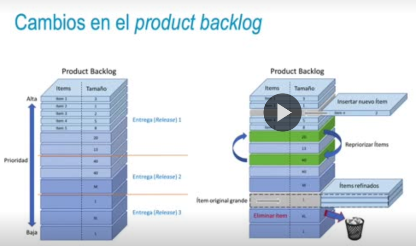
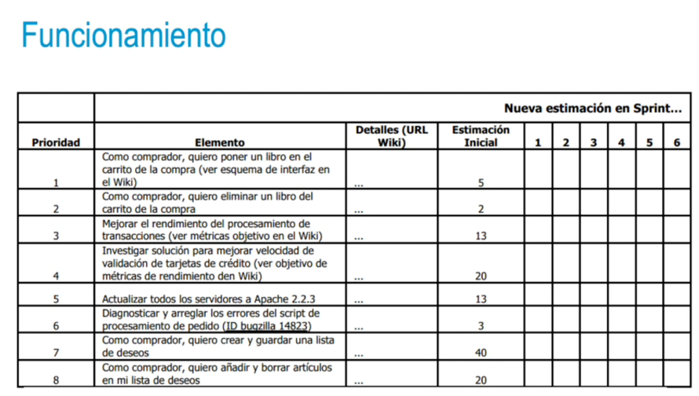
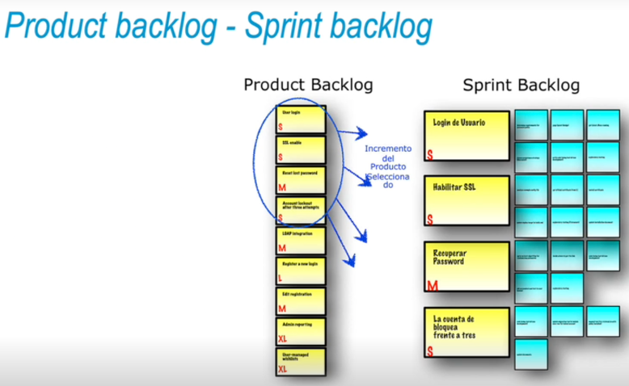
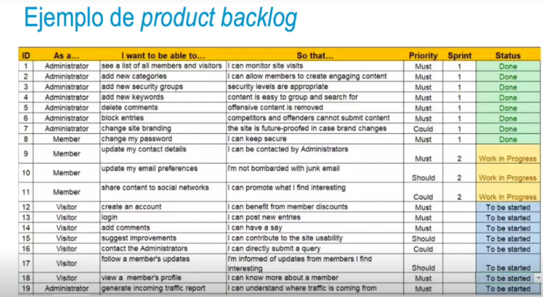

- 
- pila de requisitos priorizada
- #### Funcionamiento
  • El backlog está vivo durante todo el proceso de desarrollo.
  • Un backlog único por proyecto.
  • Determina la hoja de ruta o roadmap, con el orden de requisitos.
  • Se puede representar como un árbol de producto.
  • Variará con el tiempo; si aparece un nuevo requisito, se debe clasificar con base en las técnicas de priorización.
- {:height 393, :width 680}
-
- #### Refinamiento
  • Un backlog bien priorizado permite establecer expectativas en colaboración con el resto de las partes implicadas.
  • Se debe mantener un **backlog saludable** → revisión antes de cada reunión:
  • Comprobar si la priorización es correcta.
  • Feedback de la anterior iteración incorporado.
  • Backlog refinement (grooming): **refinamiento o ajuste** del backlog.
  • **Proceso sencillo** que sustituye al proceso de gestión de proyectos tradicionales.
  • **Comunicación** con las personas que conocen el valor esperado de proyecto.
- • Cada requisito debe contar con la información necesaria
  • Negocio debe decidir los cambios (incluir o eliminar requisito, cambiar prioridad)
  • Al planificar la siguiente reléase, se llevará a cabo el cambio.
  • Sprint backlog: requisitos en cada iteración.
  • Los requisitos se registran en el product backlog.
  • La priorización de requisitos o historias de usuario es fundamental.
  • Es importante aplicar el refinamiento de requisitos y controlar los cambios
-
- 
-
- 
-