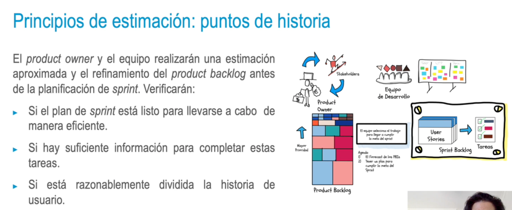
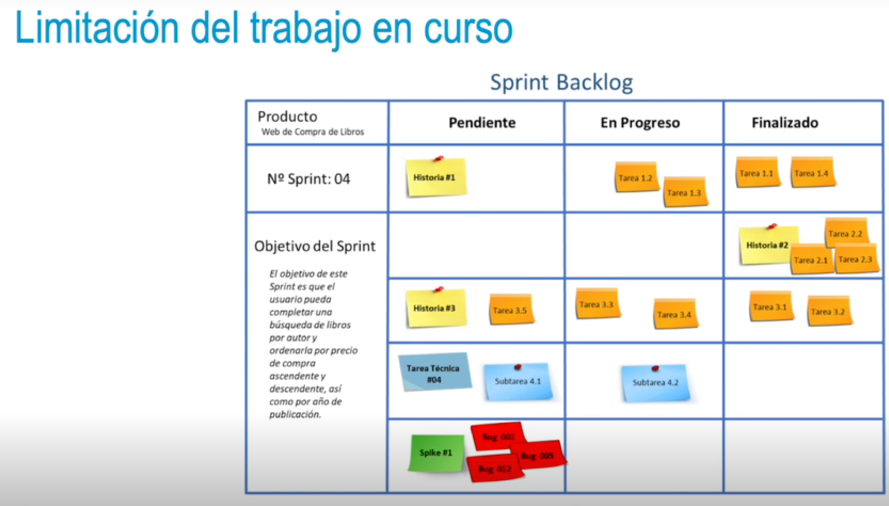

### Principios de estimación: puntos de historia
• Técnicas de estimación ágil colaborativas → Todos los implicados en el proyecto.
• No **se trata** de predecir o mejorar, sino **de minimizar** tanto como sea posible.
• Se utilizan unidades relativas, sin estimar en tiempo o coste: puntos o etiquetas cualitativas, o bien por comparación elementos.
• Se asignan los puntos de historia como medidas de esfuerzo relativo:
    • Métrica usada en gestión ágil para estimar la dificultad de implementar HU.
    • Tamaño de requisito; no miden eficiencia del tiempo, sino habilidades sobre
el problema.
- 
- ### Ejemplo puntos de historia
  Desarrollo de una aplicación web
  Un proyecto pretende desarrollar una aplicación web mediante un enfoque ágil. Así, llegará un punto en que habrá que trabajar con alguna técnica de estimación ágil, con base en las unidades relativas de medida, los puntos de historia.
  En este proyecto, un punto de historia podría ser el hacer el diseño de una página en concreto, incluyendo el texto, los gráficos o los botones interactivos, entre otros. Esto sería desarrollado por un equipo de trabajo.
  Otro punto de historia sería trabajar en el desarrollo de una funcionalidad concreta,
  enfocada, por ejemplo, en la función botón. Aquí participaría otro equipo de trabajo y sería un punto de historia más pequeño que el primero definido.
- ### Limitación del trabajo en curso
  • No sobrecargar las tareas, definir un trabajo en proceso bajo.
  • Work in progress (WIP): trabajo iniciado aún no completado; controlar posibles excesos de trabajo o problemas.
  • El enfoque ágil minimiza el trabajo en curso y limita el WIP:
  • Representar el número máximo de tareas en paralelo en un momento.
  • Restringir la cantidad de espacio asignado para las tareas en el kanban.
  • WIP = lo ideal es tener cinco tareas por columna (estado). Un número superior
  o inferior, casi con seguridad, generará problemas en ese estado o en estados
  posteriores.
-
- {:height 395, :width 680}
- ### Ejemplo WIP
  **Cadena de gestión de stock**
  Imaginemos que, en una nave de almacenaje, se ponen en marcha una serie de tareas en cadena (recepción de cajas, chequeo de cajas, movimiento de cajas, almacenaje de caja, etc.) y que todo se puede controlar mediante un software que va aprendiendo sobre las necesidades de recursos y tiempo para cada tarea.
  Para que la cadena funcione de manera adecuada, lo ideal es que todos los pasos que requieren un esfuerzo parecido tengan también una duración similar, al poder terminar los procesos al mismo ritmo y alcanzar la mayor velocidad de manera estable a largo plazo.
- Si se analizan las tareas y se aplica un enfoque ágil a este sistema, se debería trabajar en una estimación adecuada. Esta se apoyará en un tablero en el que se puedan considerar las posibles sobrecargas de tarjetas y el riesgo de que se produzca un cuello de botella en el proceso de trabajo.
  Para esto, el equipo de trabajo deberá, con las estimaciones, definir un WIP limitado a las tareas y a su capacidad (tanto de recursos humanos como de máquinas), para que no se produzca retraso y, por tanto, nose ralentice la evolución del proceso en otros estados.