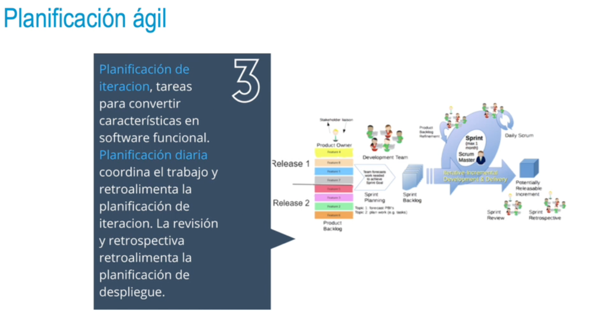
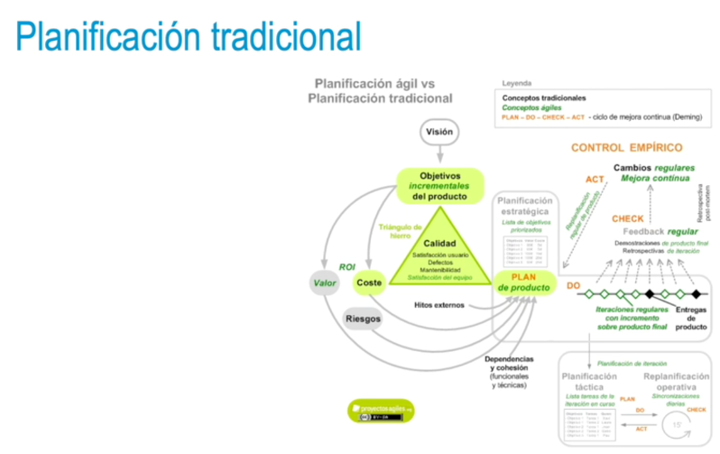

- 
- 
- {:height 370, :width 680}
-
- ### Planificación ágil vs. tradicional
  • La planificación ágil es iterativa y se adapta a los cambios:
  • Planifica en función de los objetivos de negocio.
  • Prioriza los requisitos que dan más valor al producto.
  • Es adaptativa y progresiva.
  • La planificación tradicional es predictiva y se basa en identificar tareas a priori.
- ### Planificación ágil vs. tradicional
  • Conceptos comunes:
  • Triángulo de fortaleza: objetivos, tiempo y coste.
  • Riesgos: problemas y acciones para mitigarlos.
  • Hitos externos: condicionan entregas parciales o fases.
  • Dependencias funcionales e integraciones entre componentes.
  • Cohesión: unión de trabajos realizados en conjunto.
- 
- 
-