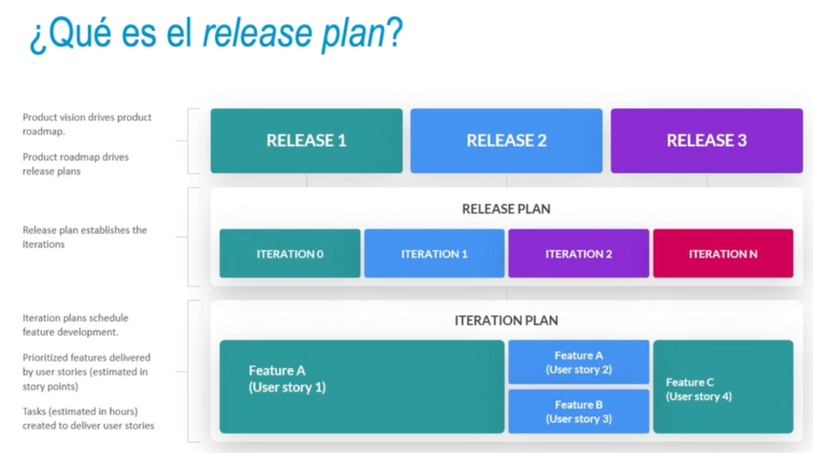

- 
- 
- Ejemplo de planificación de entregas
  =>Requisitos si se emplea la técnica MoSCoW - completa 16 puntos de historia en cada iteración:
  • M (must): dos requisitos con ocho puntos.
  • S (should): un requisito con cinco puntos y dos requisitos con cuatro puntos.
  • C (could): tres requisitos con cuatro puntos y dos requisitos con dos puntos.
  • W (would): tres requisitos con dos puntos.
- • Una posible solución óptima:
  •
  Iteración 1: un requisito M (ocho puntos) + dos requisitos S (cuatro + cuatro puntos) → se utiliza una capacidad de dieciséis puntos.
  Iteración 2: un requisito M (ocho puntos) + un requisito S (cinco puntos) + un requisito C (dos puntos) → se utiliza una capacidad de quince puntos.