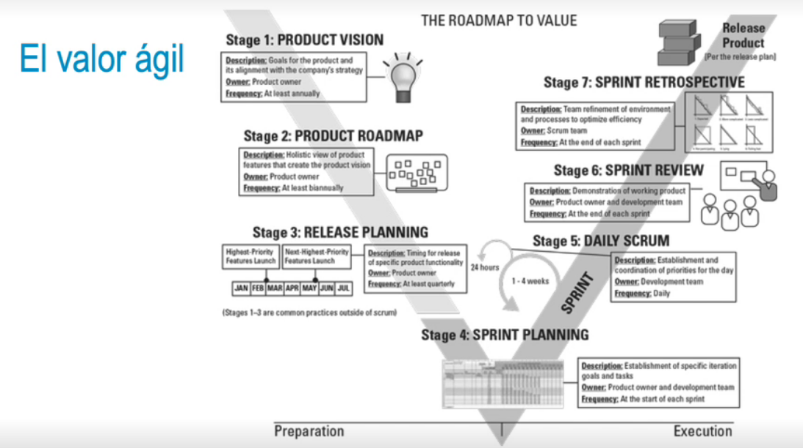

- 
- ### Consideraciones
  • Tras la identificación y priorización de requisitos (backlog product), el horizonte de planificación que
  sigue es el roadmap. Este consiste en dividir la duración del proyecto en iteraciones iguales, que
  estén agrupadas en entregas.
  • El producto owner es quien dirige el desarrollo del roadmap, por lo que decide, en última instancia,
  el orden de construcción.
  • Todas las iteraciones duran lo mismo, puesto que se aplica sobre ellas un timebox fijo.
  • Durante la estimación ágil, se determinan los valores de los puntos de historia de los requisitos. Tras
  ello, se planifica el primer release, que consiste en ajustar los requisitos de la mejor forma posible
  en las iteraciones correspondientes, según la prioridad de negocio.
- • El release plan coge el roadmap y señala qué historias de usuario van en cada iteración a través del
  mapa de historias.
  • En los proyectos ágiles, no utilizaremos un diagrama de Gantt, sino un roadmap desarrollado como
  release plan.
  • Hay que tener en cuenta las dependencias entre historias y respetarlas para que puedan
  entregarse.
  • La estrategia de gestión del riesgo consiste en ejecutar primero los requisitos con más riesgo.
-