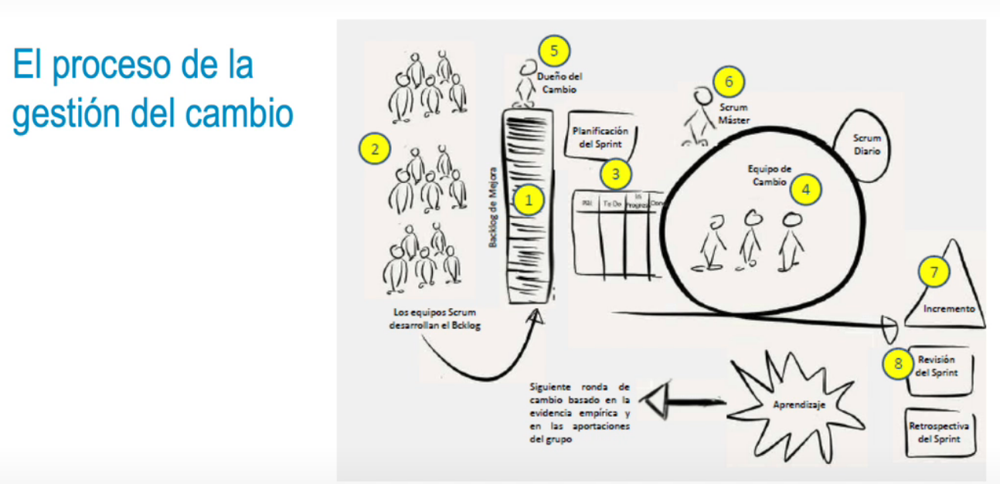

- 
-
- ### Decisión de la gestión del cambio
  • Recursos, tiempo, personas, presupuesto, tareas, valor añadido
  • Cambios en los requisitos iniciales, cambios de prioridades.
  • Afianzar la confianza con el cliente y fomentar un beneficio mutuo.
- ### Coste de los cambios
  • Plantear para quién se va a hacer el cambio y la prioridad.
  * Realizar una estimación relativa y por afinidad.
  • Situar el cambio en el lugar correcto del roadmap según prioridad.
  • Decidir qué es lo que probablemente se excluya del alcance del proyecto.
- ### Tiempo de ciclo de vida de los trabajos
  • El tiempo de ciclo es el tiempo de vida de cualquier elemento de trabajo en la gestión ágil.
  • Por ejemplo, el tiempo de ciclo de una iteración será la duración de la iteración; y el tiempo
  de ciclo de una incidencia será el lapso que transcurre desde que esta se detecta hasta que
  se soluciona.
  • Tener tiempos de ciclo más cortos implica también tiempos de respuesta más cortos, que es
  lo que busca el enfoque ágil.